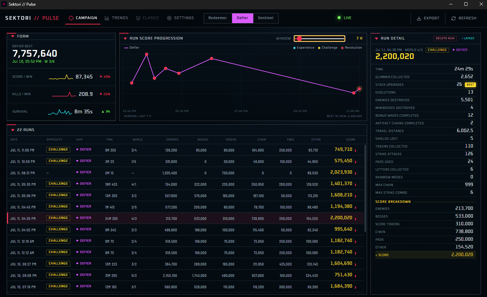

# Sektori // Pulse

**A performance companion for Sektori — because your runs deserve better than a leaderboard number.**



## Why this exists

I love Sektori. It took me almost 200 hours to beat the campaign on Challenge difficulty, and in all that time I was never bored — every run taught me something. I didn't want to stop.

Somewhere in those hours I noticed I was getting better: reading enemy patterns faster, routing more efficiently, surviving longer. I wanted to actually *see* that progress instead of just feeling it, and use it as fuel to keep pushing. The game's save file only remembers lifetime totals and personal bests — it doesn't keep the story of any single run. So I built Pulse to keep that story for me.

## What it does

Pulse runs quietly alongside Sektori and picks up the moment a run ends:

- **Watches for the results screen** and automatically pages through all four result pages (Campaign Challenge, Statistics ×2, Score Breakdown) using a virtual controller — no manual screenshotting, no interrupting your flow.
- **Reads every stat off the screen** with on-device OCR, cross-checked against the score breakdown so misreads get caught before they pollute your history.
- **Builds a run archive** you can scroll, filter by ship, and drill into — click any point on a chart or any "best" stat to jump straight to the run that set it.
- **Tracks personal bests per stat, per ship** — Redeemer, Defier, and Sentinel play too differently to share one leaderboard, so each gets its own.
- **Shows trends over time**: score/minute, kills/minute, survival time, score composition — with an adjustable time window instead of a single flat wall of numbers.
- **A subtle in-game overlay** so you always know Pulse is watching, without it fighting for your attention while you play.

Everything runs locally. Pulse reads the Sektori save file without ever modifying it, and nothing leaves your machine.

## More modes are coming

Right now Pulse tracks the **Campaign** — that's where the nearly 200 hours went, so it's where the tracking started. Sektori has several other modes (Classic, and more), and the dashboard already has a spot reserved for them: you'll see a grayed-out **Classic** tab waiting in the nav. Turning that into a real tracker — and adding the modes after it — is next.

## Installing

1. Grab the latest installer from the [Releases page](../../releases).
2. Run it — it installs to `Program Files` and needs an admin prompt for that.
3. Launch Sektori Pulse and play. It finds your save file automatically; if it ever can't, you can point it at the file manually from Settings.

Windows only, for now. Requires Sektori to be installed via Steam.

## Privacy

Pulse is local-first: it reads your Sektori save and (optionally) Steam's local achievement cache in read-only mode, and keeps everything it captures on your own machine. Nothing is uploaded, ever. Export is a manual, explicit action if you ever want a copy of your own data.

## For developers

```powershell
npm install
npm run electron:dev   # run the app in dev mode
npm run dev             # preview the dashboard alone, with demo data, in a browser
npm run dist             # build the Windows installer (release/)
```

See [CHANGELOG.md](CHANGELOG.md) for the development history.
